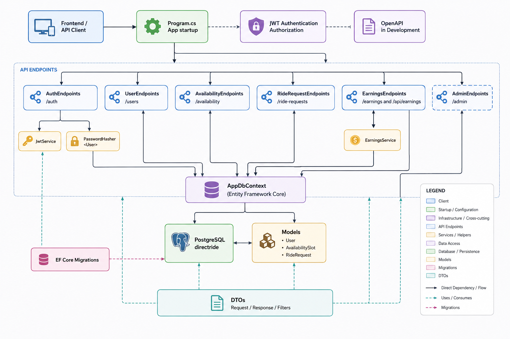
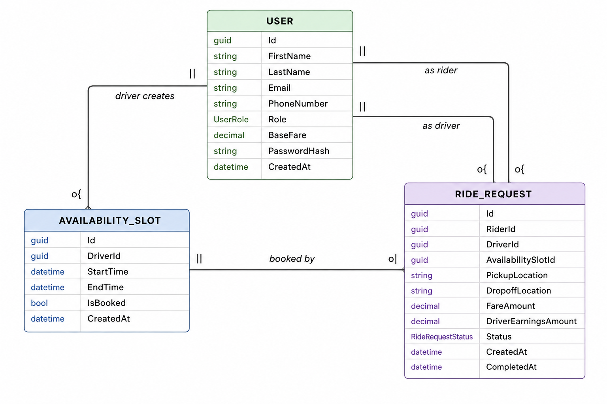

# DirectRide APIs

DirectRide is a private ride-booking backend that allows riders to book rides directly with drivers, eliminating middleman fees.

## Tech Stack
- ASP.NET Core Web API
- Entity Framework Core
- PostgreSQL
- Docker
- xUnit (integration tests)

## Features
- User management (riders, drivers, and admins)
- Driver availability scheduling
- Ride request system
- Booking logic (prevents double-booking)
- Accept/decline ride requests
- DTO-based API design
- Integration test coverage

## Architecture Diagrams

### Backend Architecture



### Data Models



## Endpoints

Most endpoints require a bearer token from `POST /auth/login`. Public endpoints are noted below.

### Health

| Method | Endpoint | Auth | Description |
| --- | --- | --- | --- |
| `GET` | `/health` | Public | Returns API health status for deployment health checks. |

### Auth

| Method | Endpoint | Auth | Description |
| --- | --- | --- | --- |
| `POST` | `/auth/login` | Public | Authenticate with email and password. Returns a JWT and basic user details. |

Request body:

```json
{
  "email": "driver@example.com",
  "password": "password123"
}
```

### Users

| Method | Endpoint | Auth | Description |
| --- | --- | --- | --- |
| `GET` | `/users/test` | Public | Returns a sample driver user. |
| `POST` | `/users` | Public | Create a rider or driver account. |
| `GET` | `/users/me` | Required | Get the currently authenticated user. |
| `GET` | `/users` | Required | Get paginated users. Supports search, role, and status filters. |
| `GET` | `/users/{id}` | Required | Get a user by ID. |
| `PUT` | `/users/{id}` | Required | Replace a user's profile fields. |
| `PATCH` | `/users/{id}` | Required | Update one or more user profile fields. |

Create user body:

```json
{
  "firstName": "Razzo",
  "lastName": "Driver",
  "email": "razzo@directride.com",
  "phoneNumber": "555-555-5555",
  "role": 1,
  "password": "password123"
}
```

Update user body:

```json
{
  "firstName": "Razzo",
  "lastName": "Driver",
  "email": "razzo@directride.com",
  "phoneNumber": "555-555-5555",
  "role": 1,
  "baseFare": 25.00
}
```

Patch user body supports any subset of `firstName`, `lastName`, `email`, `phoneNumber`, `role`, and `baseFare`.

`GET /users` query filters:

| Query parameter | Type | Notes |
| --- | --- | --- |
| `page` | `int` | Defaults to `1`. Values below `1` are treated as `1`. |
| `pageSize` | `int` | Defaults to `20`. Clamped between `1` and `100`. |
| `search` | `string` | Matches full name, email, or phone number. |
| `role` | `UserRole` or `int` | Accepts role names, numeric role values, or `All Roles`. |
| `status` | `string` | `All Statuses` returns all users. `Deactivated` currently returns no users. |

`GET /users` response:

```json
{
  "items": [
    {
      "id": "00000000-0000-0000-0000-000000000000",
      "firstName": "Razzo",
      "lastName": "Driver",
      "email": "razzo@directride.com",
      "phoneNumber": "555-555-5555",
      "role": "Driver",
      "baseFare": 25.00
    }
  ],
  "page": 1,
  "pageSize": 20,
  "totalItems": 1,
  "totalPages": 1,
  "hasPreviousPage": false,
  "hasNextPage": false
}
```

User roles:

| Value | Role |
| --- | --- |
| `0` | Rider |
| `1` | Driver |
| `2` | Admin |

### Availability

| Method | Endpoint | Auth | Description |
| --- | --- | --- | --- |
| `GET` | `/availability` | Required | Get driver availability slots. Defaults to unbooked slots when `isBooked` is omitted. |
| `POST` | `/availability` | Required | Create a driver availability slot. |

`GET /availability` query filters:

| Query parameter | Type |
| --- | --- |
| `driverId` | `Guid` |
| `driverName` | `string` |
| `startTimeFrom` | `DateTime` |
| `startTimeTo` | `DateTime` |
| `endTimeFrom` | `DateTime` |
| `endTimeTo` | `DateTime` |
| `isBooked` | `bool` |
| `createdAtFrom` | `DateTime` |
| `createdAtTo` | `DateTime` |

Create availability body:

```json
{
  "driverId": "00000000-0000-0000-0000-000000000000",
  "startTime": "2026-05-11T14:00:00Z",
  "endTime": "2026-05-11T16:00:00Z"
}
```

### Ride Requests

| Method | Endpoint | Auth | Description |
| --- | --- | --- | --- |
| `GET` | `/ride-requests` | Required | Get ride requests with rider, driver, availability, fare, earnings, status, and completion details. |
| `POST` | `/ride-requests` | Required | Create a ride request and mark the availability slot as booked. Fare and driver earnings are set from the driver's base fare. |
| `PUT` | `/ride-requests/{id}` | Required | Update all editable ride request fields. Moving a ride to a different availability slot frees the old slot and books the new one. |
| `PATCH` | `/ride-requests/{id}/status?status={status}` | Required | Update a ride request status. Declined requests free the availability slot; completed requests set `completedAt`. |

`GET /ride-requests` query filters:

| Query parameter | Type |
| --- | --- |
| `riderId` | `Guid` |
| `riderName` | `string` |
| `driverId` | `Guid` |
| `driverName` | `string` |
| `availabilitySlotId` | `Guid` |
| `pickupLocation` | `string` |
| `dropoffLocation` | `string` |
| `status` | `RideRequestStatus` |
| `slotStartTimeFrom` | `DateTime` |
| `slotStartTimeTo` | `DateTime` |
| `slotEndTimeFrom` | `DateTime` |
| `slotEndTimeTo` | `DateTime` |
| `createdAtFrom` | `DateTime` |
| `createdAtTo` | `DateTime` |

Create ride request body:

```json
{
  "riderId": "00000000-0000-0000-0000-000000000000",
  "driverId": "00000000-0000-0000-0000-000000000000",
  "availabilitySlotId": "00000000-0000-0000-0000-000000000000",
  "pickupLocation": "123 Main St",
  "dropoffLocation": "456 Oak Ave"
}
```

Update ride request body:

```json
{
  "riderId": "00000000-0000-0000-0000-000000000000",
  "driverId": "00000000-0000-0000-0000-000000000000",
  "availabilitySlotId": "00000000-0000-0000-0000-000000000000",
  "pickupLocation": "123 Main St",
  "dropoffLocation": "456 Oak Ave",
  "fareAmount": 84.25,
  "driverEarningsAmount": 72.50,
  "status": 3,
  "createdAt": "2026-07-19T12:30:00Z",
  "completedAt": "2026-07-20T15:05:00Z"
}
```

Ride request statuses:

| Value | Status |
| --- | --- |
| `0` | Pending |
| `1` | Accepted |
| `2` | Declined |
| `3` | Completed |
| `4` | Cancelled |
