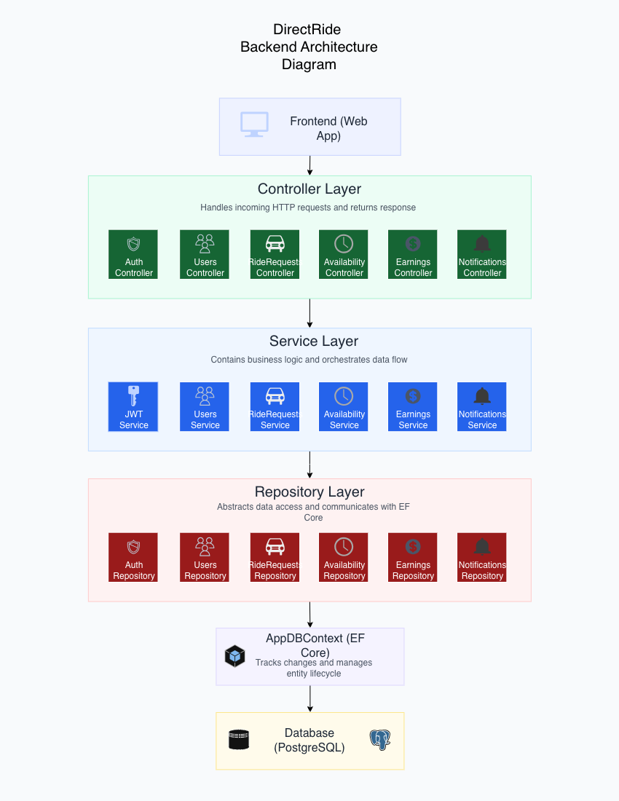
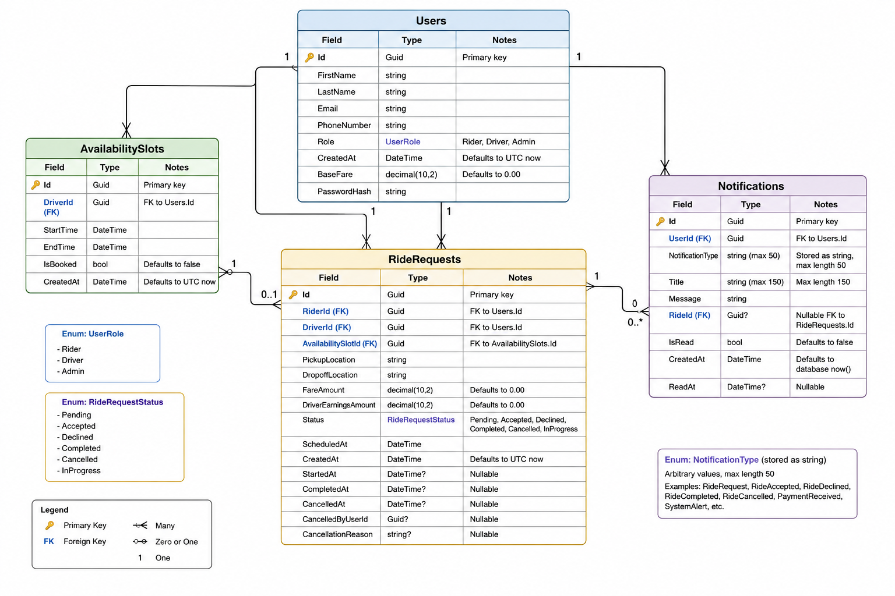

# DirectRide APIs

DirectRide is a private ride-booking backend that allows riders to book rides directly with drivers, eliminating middleman fees.

## Project Overview

DirectRide APIs is the backend for DirectRide, a full-stack cloud-native ride booking platform that connects riders directly with drivers without charging marketplace fees.

This repository exposes a RESTful ASP.NET Core Web API responsible for authentication, user management, driver availability, ride requests, notifications, and business logic. It serves as the central service layer between the frontend application and the PostgreSQL database.

The API was designed as a portfolio project to demonstrate modern backend engineering practices, cloud deployment on AWS, secure authentication, scalable architecture, and production-oriented software design.

## Architecture Diagrams

### Backend Architecture

High-level view of the API architecture and request flow.



### Data Model

Core entities and relationships used throughout DirectRide.



## Tech Stack

- ASP.NET Core Web API
- C#
- Entity Framework Core
- PostgreSQL
- JWT
- Amazon S3
- AWS ECS Fargate
- Terraform
- Docker
- GitHub Actions
- xUnit

## Why This Tech Stack

| Technology            | Why I Chose It                                                                      |
| --------------------- | ----------------------------------------------------------------------------------- |
| ASP.NET Core          | High-performance framework with strong dependency injection and enterprise tooling. |
| Entity Framework Core | Simplifies database access while keeping queries maintainable.                      |
| PostgreSQL            | Open-source relational database with excellent performance and AWS RDS support.     |
| Docker                | Consistent deployments across development and production environments.              |
| Terraform             | Infrastructure as Code for repeatable cloud deployments.                            |
| AWS ECS               | Container orchestration without Kubernetes complexity.                              |
| Amazon S3             | Durable object storage for user profile photos without storing image data in PostgreSQL. |
| GitHub Actions        | Automated CI/CD deployments using OIDC authentication.                              |

## Engineering Decisions

### JWT Authentication

Authentication uses JWT bearer tokens with issuer, audience, lifetime, and signing key validation. This keeps authentication stateless so the API can scale horizontally without server-side session storage.

### Entity Framework Core

Entity Framework Core powers PostgreSQL access through `AppDbContext`, repositories, and migrations. It keeps database changes maintainable while still allowing query optimization through LINQ, eager loading, and targeted repository methods.

### Layered Architecture

Route mapping stays lightweight by delegating ride request, availability, user, notification, and earnings logic to services and repositories. This separation keeps business rules easier to test and prevents endpoint handlers from becoming tightly coupled to database operations.

### Docker Containers

The API uses a multi-stage Dockerfile and Docker Compose setup so local development and production deployments run from the same containerized application model. The container listens on port `8080`, which aligns cleanly with AWS ECS Fargate deployment patterns.

### PostgreSQL

PostgreSQL was selected because ride scheduling, bookings, users, notifications, and earnings rely on relational data and transactional consistency. The EF Core model defines explicit relationships between riders, drivers, availability slots, ride requests, and notifications.

### Environment-Based Configuration

Database, JWT, CORS, and S3 settings are read from configuration and environment variables, allowing the same application code to run locally, in Docker, and in AWS.

## Features

### Authentication

- JWT login
- Secure password hashing
- Protected endpoints

### User Management

- Rider accounts
- Driver accounts
- Admin users
- Profile management
- JPEG, PNG, and WebP profile-photo upload and removal

### Ride Scheduling

- Driver availability
- Booking logic
- Prevent double-booking

### Ride Management

- Create rides
- Accept/decline
- Complete rides
- Ride status updates

### Notifications

- Ride lifecycle notifications
- Driver updates
- Rider updates

### Testing

- Integration tests
- Health endpoint

## Project Structure

```text
.
├── .github/
│   └── workflows/              # GitHub Actions CI/CD workflow definitions
├── DirectRide.Api/
│   ├── Controllers/            # Minimal API route groups and endpoint mappings
│   ├── DTOs/                   # Request and response contracts grouped by feature
│   ├── Data/                   # EF Core DbContext, design-time factory, and connection string helpers
│   ├── Enums/                  # Shared domain enums such as user roles and ride statuses
│   ├── Migrations/             # EF Core database migrations
│   ├── Models/                 # Core domain entities
│   ├── Properties/             # ASP.NET Core launch settings
│   ├── Repositories/           # Data access abstractions and EF Core repository implementations
│   ├── Scripts/                # Database seed and utility scripts
│   ├── Services/               # Business logic for rides, users, notifications, earnings, and JWTs
│   ├── Dockerfile              # Multi-stage container build for the API
│   └── Program.cs              # Application startup, dependency injection, middleware, and route registration
├── DirectRide.Api.Tests/       # xUnit integration and service tests
├── docs/                       # Architecture diagrams and supporting documentation
├── docker-compose.yml          # Local API and PostgreSQL development environment
└── README.md                   # Project documentation
```

## API Documentation

Detailed endpoint documentation is available in [docs/API_DOCUMENTATION.md](docs/API_DOCUMENTATION.md).

## Getting Started

To set up the API locally, follow the [local development environment setup guide](docs/local_dev_env_setup.md).

## Roadmap

Upcoming features planned for future versions of DirectRide APIs include:

- OAuth login with Amazon Cognito
- Payment integration
